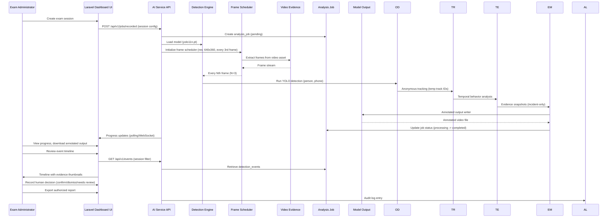

# Architecture

## Overview Diagram (Mermaid Context)

```mermaid
context AI Classroom Cheating Detection System
    actor "Exam Administrator / Invigilator" as AA
    actor "Authorized Reviewer" as AR
    actor "System Administrator" as SA
    partition "Laravel Dashboard" {
        layer "Web UI / Blade Templates" as UI
        layer "API Gateway" as API
        layer "MySQL / PostgreSQL" as DB
    }
    partition "AI Service (Python FastAPI)" {
        layer "Detection Engine" as DE
        layer "Frame Scheduler" as FS
        layer "Input Adapters" as IA
        layer "Output Adapters" as OA
    }
    partition "Evidence & Storage" {
        layer "Local Evidence Directory" as ED
        layer "Processed Output Directory" as OD
        layer "Audit Log Database" as AL
    }
    
    AA --> UI: Authenticated actions
    AR --> UI: Review actions
    SA --> UI: System administration
    UI <--> API: Blade + REST API
    API <--> DE: versioned internal API
    DE <--> DB: analysis_jobs, detection_events, audit_logs
    DE <--> ED: incident snapshots
    DE <--> OD: annotated output video
```

## Container / Component Diagram (Mermaid)

```mermaid
partition "AI Service" {
    direction LR
    component "FastAPI App" as fa
    component "Router / Middleware" as rm
    component "Config Loader" as cl
    component "Model Cache" as mc
    component "Detector Wrapper" as dw
    component "Tracker (ByteTrack/DS)" as tr
    component "Event Engine" as ee
    component "Evidence Manager" as em
    component "Metrics Collector" as mc_
    component "Health Endpoint" as he
}
    
fa --> rm --> cl --> dw
fa --> fs: Frame Scheduler
fa --> ee: Event Engine
fa --> em: Evidence Manager
fa --> mc_: Metrics Collector
fa --> he: Health Endpoint

subgraph "Input Adapters (Interchangeable)"
    direction TB
    component "RecordedVideoInput" as ri
    component "WebcamInput" as wi
    component "RtspStreamInput" as si
    component "TestVideoInput" as ti
end
    
subgraph "Output Adapters"
    direction TB
    component "AnnotatedVideoOutput" as vo
    component "DashboardStreamOutput" as do
    component "EventRepositoryOutput" as eo
    component "EvidenceStorageOutput" as eo2
end

ri --> dw; wi --> dw; si --> dw; ti --> dw
dw --> tr; dw --> ee
tr --> ee
ee --> em; ee --> mc_
em --> ED; em --> OD
mc_ --> OD: metrics dashboard
```

## Shared-Engine Diagram

The single shared AI detection engine serves both operating modes. Input adapters differ; the core pipeline is identical.

```mermaid
flowchart TD
    subgraph "Shared Detection Engine (One Pipeline)"
        direction LR
        IA[Input Adapter] --> FS[Frame Scheduler]
        FS --> PP[Frame Preprocessor]
        PP --> OD[Object Detector]
        OD --> PO[Pose/Orientation Estimator]
        PO --> TR[Anonymous Tracker]
        TR --> TE[Temporal Event Engine]
        TE --> RB[Bounding-Box Renderer]
        RB --> EM[Evidence Manager]
        EM --> MC[Metrics Collector]
        MC --> OA[Output Adapter]
    end
    
    IA --> IA_recorded: RecordedVideoInput
    IA --> IA_webcam: WebcamInput
    IA --> IA_rtsp: RtspStreamInput
    IA --> IA_test: TestVideoInput
    
    OA --> OA_video: AnnotatedVideoOutput
    OA --> OA_dashboard: DashboardStreamOutput
    OA --> OA_events: EventRepositoryOutput
    OA --> OA_evidence: EvidenceStorageOutput
    
    style SharedEngine fill:#e3f2fd,stroke:#1565c0,stroke-width:2px
    style InputAdapters fill:#bbdefb,stroke:#0b4d73,stroke-width:1px
    style OutputAdapters fill:#bbdefb,stroke:#0b4d73,stroke-width:1px
```

## Recorded-Mode Sequence Diagram



## Live-Mode Sequence Diagram

```mermaid
sequenceDiagram
    participant AA as Invigilator
    participant UI as Dashboard UI
    participant API as AI Service API
    participant DE as Detection Engine
    participant FS as Frame Scheduler
    participant CA as Camera Adapter
    participant AL as Alert Queue
    participant EV as Evidence Snapshots
    
    AA->>UI: Start monitoring session
    UI->>API: POST /api/v1/live/start (session_id, camera_id)
    API->>CA: Initialize camera source (webcam/RTSP)
    CA->>FS: Begin frame capture loop
    FS->>DE: Every Nth frame (N=3, configurable)
    DE->>OD: Run YOLO detection (person, phone)
    OD->>TR: Anonymous tracking (temp track IDs)
    TR->>TE: Temporal behavior analysis
    TE->|Suspicious event| AL: Alert queue enqueue
    AL->>UI: Live alert (bounding box + label)
    TE->>EV: Evidence snapshot (incident-only, on threshold)
    EV->>EV: Store locally; do not record continuous video
    UI->>API: GET /api/v1/live/{session_id}/health
    API->>CA: Stream health status (FPS, latency, reconnect count)
    CA->>FS: Reconnect logic if stream lost
    API->>AL: Alert delivery (Server-S Events / polling)
    AA->>UI: Confirm / dismiss / defer events
    AA->>UI: Close session
    API->>CA: Stop camera capture
    API->>AL: Session summary generation
```

## AI Service Boundaries

- **Input**: Interchangeable input adapters (RecordedVideoInput, WebcamInput, RtspStreamInput, TestVideoOutput)
- **Processing**: Single shared pipeline (detector → tracker → temporal rules → event engine → renderer → evidence → metrics)
- **Output**: Output adapters (AnnotatedVideoOutput, DashboardStreamOutput, EventRepositoryOutput, EvidenceStorageOutput)
- **Configuration**: Centralized config (YAML/.env); all temporal rules, confidence thresholds, cooldowns adjustable
- **Authentication**: Versioned internal API between Laravel dashboard and AI service (JWT/bearer token; details in API_CONTRACT.md)
- **No facial recognition**: Person class only; no identity, emotion, or intention inference
- **Dashboard boundaries**: Receives annotated preview (configurable resolution/fps), alert metadata, status health; does NOT receive every full-resolution processed frame
- **Storage boundaries**: Evidence snapshots (incident-only); annotated output videos; audit logs; no continuous raw-video recording; temporary frame extraction cleaned up after job completion

## Configuration Flow

```mermaid
flowchart TD
    subgraph "Configuration Sources"
        C1[.env (camera credentials, API keys)] 
        C2[config.yaml (detection thresholds, temporal rules, resolution, frame interval)]
        C3[requirements.txt (pinned dependencies)]
        C4[ultralytics model weights (yolo11n.pt, AGPL-3.0)]
    end
    
    subgraph "Config Loader (FastAPI Startup)"
        CL[Config Loader] --> C1
        CL --> C2
        CL --> C3
        CL --> C4
    end
    
    CL -->|Loads| CFG[Runtime Configuration Object]
    
    subgraph "Configuration Distribution"
        CFG --> DP[Detection Engine (confidence threshold, temporal rules)]
        CFG --> FS[Frame Scheduler (resolution, process-every-N-frames)]
        CFG --> EM[Evidence Manager (image quality, max clip duration)]
        CFG --> MM[Metrics Collector (FPS targets, latency targets)]
    end
    
    style C4 fill:#fff3e0,stroke:#ff9800,stroke-width:2px
    style CL fill:#e8f5e9,stroke:#2e7d32,stroke-width:2px
```

## Error Flow

```mermaid
flowchart TD
    subgraph "Error Handling in Detection Engine"
        direction LR
        E1[Input Adapter Failure] --> E2[Exception raised in adapter]
        E2 --> E3[Error middleware catches exception]
        E3 --> E4[Job status: failed]
        E3 --> E5[Progress: "failed" displayed in dashboard]
        E3 --> E6[Audit log: "analysis_job_failed"] 
        E3 --> E7[User notified: Cancel / Retry options]
        E4 --> E8[Resource cleanup (release capture, clear temp files)]
        E8 --> E9[Job moved to "cancelled/failed" state]
        E9 --> E10[Dashboard shows final status with failure_reason]
        
        %% Runtime inference errors
        E10a[Inference error (OUCH, OOM)] --> E3
        E10a --> E11[Progress: "error" status]
        E11 --> E12[Audit log: "inference_error"]
        E12 --> E13[Dashboard: error details (redacted, no secrets)]
        
        %% Model load failure
        E14[Model load failure] --> E3
        E15[Progress: "model_load_failed"] 
        E15 --> E16[Audit log: "model_load_failure"]
        E16 --> E17[Dashboard: "Model unavailable; using previous version if cached"]
    end
    
    style E2 fill:#ffebee,stroke:#c62828,stroke-width:2px
    style E4 fill:#ffebee,stroke:#c62828,stroke-width:2px
    style E8 fill:#fff3e0,stroke:#ff9800,stroke-width:2px
```

## Event Flow

```mermaid
flowchart TD
    subgraph "Temporal Event Engine Flow"
        direction LR
        D1[Detector Output: person / phone] --> C1[Config: confidence threshold]
        C1 -->|pass| C2[Tracker: assign/update temp track ID]
        C2 --> C3[Orientation Estimator: heading (left/right/back)]
        C3 -->|above threshold| C4[Temporal Rules Engine]
        C4 -->|min consecutive observations met| C5[Event Generated]
        C5 --> C6[Evidence Manager: save incident snapshot]
        C6 --> C7[Metrics: increment event counter, record latency]
        C7 --> C8[Output Adapter: publish alert to dashboard]
        C8 --> C9[Dashboard: bounding box + label + temporary track ID]
        
        %% Cooldown branch
        C5 -->|cooldown active| C10[Suppress duplicate alerts (configurable frames)]
        C10 --> C1[Config: confidence threshold (reset for next cycle)]
        
        %% Insufficient evidence branch
        C4 -->|min consecutive observations NOT met| C11[State: Insufficient evidence (S2)]
        C11 --> C12[Evidence: capture frames in observation window; mark "insufficient"]
        C12 --> C13[Metrics: record "insufficient" count]
        C13 --> C1[Config: confidence threshold]
    end
    
    style C1 fill:#e3f2fd,stroke:#1565c0,stroke-width:2px
    style C4 fill:#e3f2fd,stroke:#1565c0,stroke-width:2px
    style C11 fill:#fff3e0,stroke:#ff9800,stroke-width:2px
    style C9 fill:#e8f5e9,stroke:#2e7d32,stroke-width:2px
```

## Audit Flow

```mermaid
flowchart TD
    subgraph "Audit Logging Flow"
        direction LR
        A1[Operational action (login, session start, job create, event view, evidence view, event review, report export)] --> A2[Middleware intercepts request]
        A2 --> A3[Identify actor (user_id where available, "system" if service-account)]
        A3 --> A4[Record action type]
        A4 --> A5[Record target type and identifier (job_id, event_id, session_id)]
        A5 --> A6[Record timestamp (ISO 8601)]
        A6 --> A7[Record IP address (where appropriate, safe-only)]
        A7 --> A8[Record user agent (safe portions only)]
        A8 --> A9[Record session/correlation identifier]
        A9 --> A10[Record result status (success, failure, cancelled)]
        A10 --> A11[Write to audit_logs table (MySQL)]
        A11 --> A12[Queryable for: session filtering, job status, event type, review status, timestamp range]
        
        %% Never include in audit entries
        NB1[Never include: passwords, tokens, camera passwords, raw secret URLs, full sensitive payloads]
        
        style A2 fill:#e3f2fd,stroke:#1565c0,stroke-width:2px
        style NB1 fill:#ffebmee,stroke:#c62828,stroke-width:2px,color:#c62828
    end
    NB1 -.-> A1
```

## Credential Protection

```mermaid
flowchart TD
    subgraph "Camera Credential Protection Strategy"
        direction LR
        C1[Camera source registered in dashboard] --> C2[Credentials entered (login/password for RTSP/HTTP)]
        C2 --> C3[Config Loader encrypts; stores in .env file]
        C3 --> C4[.env excluded from Git (.gitignore)]
        C4 --> C5[API responses: credential values NEVER returned]
        C5 --> C6[Audit logs: never include raw credential values]
        C6 --> C7[Credential abstraction layer: API interacts with adapter, not raw credentials]
        C7 --> C8[If EZVIZ unavailable: recorded mode fully usable; live mode testable via local webcam]
        C8 --> C9[Dashboard UI: credentials not displayed after saving]
    end
    
    style C1 fill:#e3f2fd,stroke:#1565c0,stroke-width:2px
    style C4 fill:#e3f2fd,stroke:#1565c0,stroke-width:2px
    style C6 fill:#e3f2fd,stroke:#1565c0,stroke-width:2px
    style C7 fill:#e3f2fd,stroke:#1565c0,stroke-width:2px
```
## Resource-Constrained Design Decisions

| Decision | Rationale | Constrained By |
|----------|-----------|----------------|
| Lightweight YOLO nano model only | 8 GB RAM insufficient for larger models; CPU-only | RAM, GPU absence |
| Process every 3rd frame by default | Reduces CPU load ~3x; maintains acceptable FPS | RAM, CPU |
| Single camera at a time | Minimal implementation; shared engine | RAM, dev computer limitation |
| Incident-only evidence storage | No continuous recording; storage efficient | SSD capacity, privacy |
| 640x360 resolution default | Fits typical exam camera view; reduces pixel count vs 1080p | RAM, CPU, bandwidth |
| 480x270 alternative for low-resource | Higher FPS than 640x360 on same hardware | RAM, CPU |
| Anonymous tracking (temp track IDs only) | No identity storage; privacy by design | Privacy constraints, GDPR/FERPA |
| No facial recognition | Explicitly forbidden; legal/ethical | Privacy, institutional policy |
| Temporal rules configurable, not hard-coded | Allows tuning without code changes; prevents unexplained magic values | Maintainability, scientific rigor |
| One model instance per worker | Avoids memory pressure from double loading | 8 GB RAM |
| Frame extraction to temp directory, cleanup after job | Prevents evidence accumulation; storage management | SSD capacity, retention policy |
| API between Laravel and AI service only | Network isolation; no secrets in dashboard | Security, credential protection |